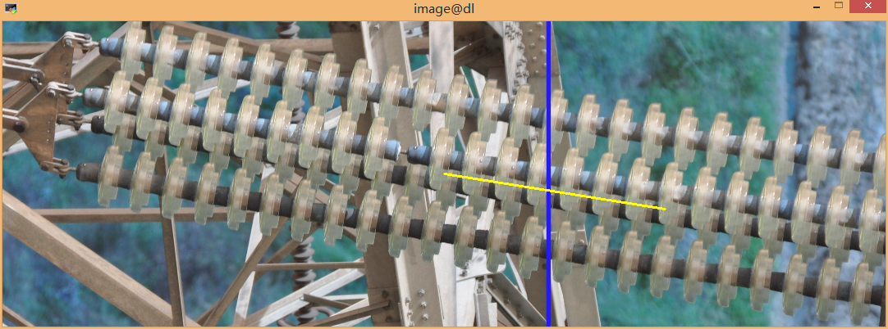

# Purpose
- in order to regress the angle of the insulator

# build regression
## feature extraction
- resnet152
## Loss
- L1_Smooth_loss

# How to use?
## train
- main(mode="train") 
## validate
- main(mode="validate",resume='./model_best.pth.tar')
## test
- main(mode="test", resume='./models/checkpoint.pth.tar') 
## test on one image
- ui_test(filename, model_dir)
```bash
$ python train_regression.py 
```

# Experiment
## The yellow line indicates the direction of the insulator slanting
### test1.jpg
-
### test2.jpg
-

